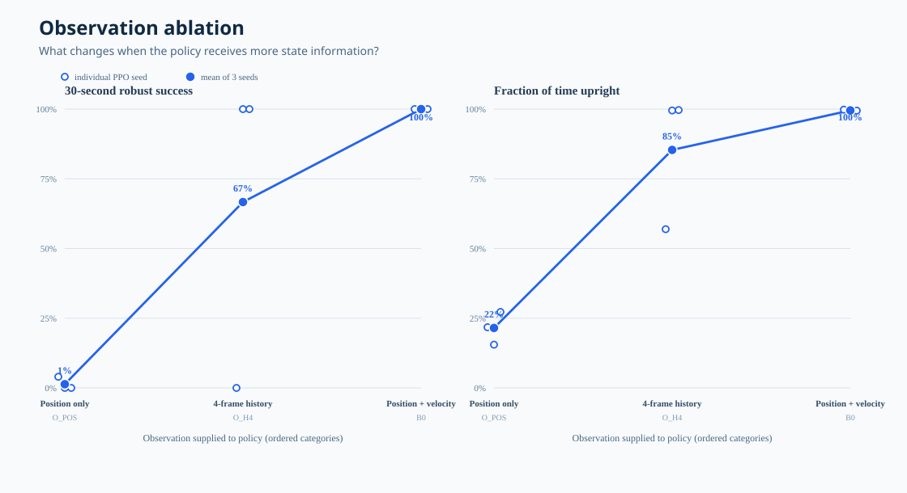
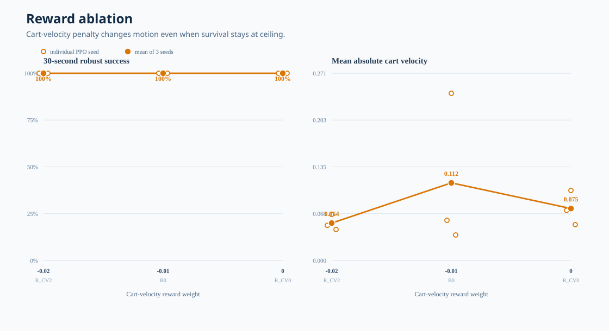
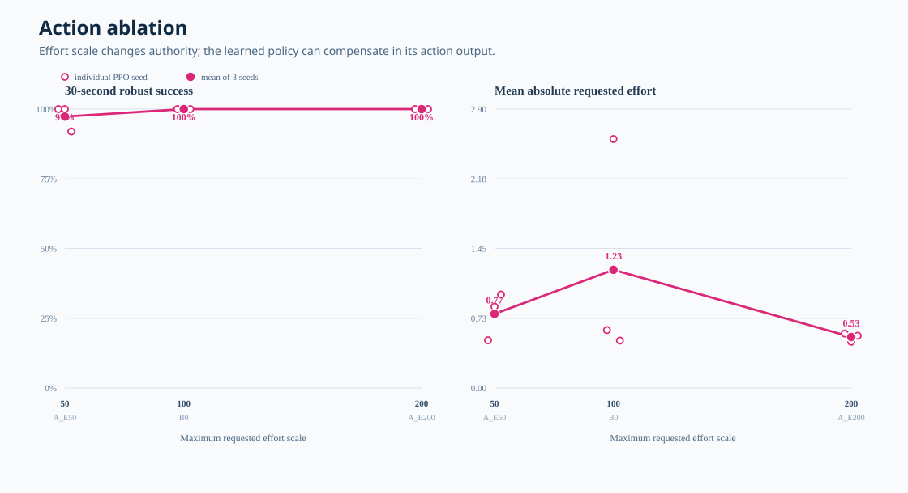
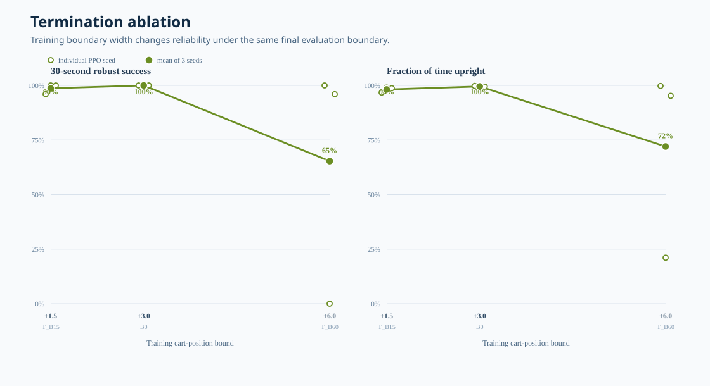
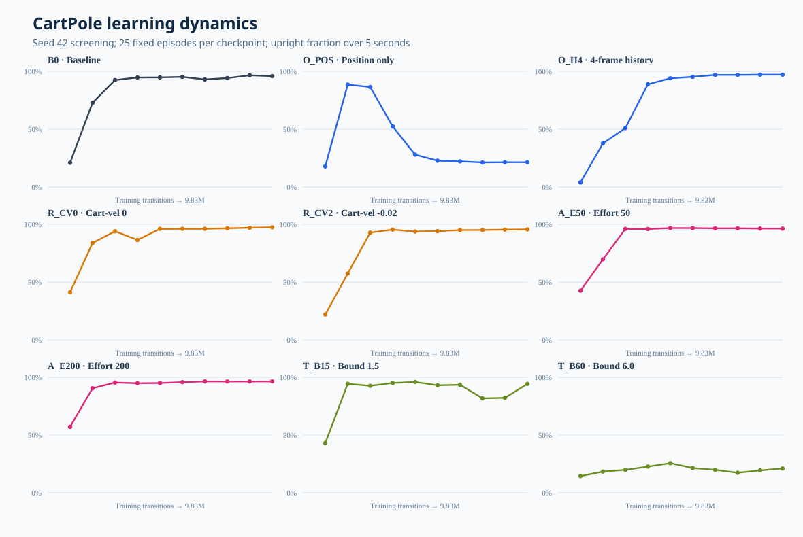

# Phase 2 CartPole Controlled Study

The preregistered study is complete. All 27 trained-policy cells succeeded:
9 variants × 3 PPO training seeds. Each final policy was evaluated for 25
fixed, parallel 30-second episodes, producing 675 final episodes.

The protocol is
[`docs/PHASE2_STUDY_PROTOCOL.md`](../../docs/PHASE2_STUDY_PROTOCOL.md).
Each attempted run follows
[`run_manifest.schema.json`](../../experiments/01_cartpole_ppo/run_manifest.schema.json).

## One-factor results

Velocity observation was the dominant requirement. Position-only policies
almost completely failed (`1.3% ± 2.3%` robust success); four-frame position
history recovered two of three training seeds but remained seed-sensitive
(`66.7% ± 57.7%`). Reward and action-scale variants retained near-ceiling
success, while the wide training boundary produced one catastrophic seed.

Each figure below changes exactly one factor. The left panel always shows the
30-second robust-success outcome. The right panel shows the most informative
secondary behavior metric for that factor. Open circles are the three
independently trained PPO seeds; the filled circle and line show their mean.

### Observation



### Reward



### Action



### Termination



The complete interpretation, exact table, limitations, and next-step decision
are in the [paper-style results report](report/README.md).

## Learning dynamics

The screening curve uses seed 42 and ten saved checkpoints per variant. It
shows why final-checkpoint-only evaluation is insufficient: position-only PPO
briefly approached 90% upright before degrading toward 20%, while four-frame
history continued improving.



## Committed evidence

```text
phase2/
  manifests/              27 immutable run manifests
  evaluations/
    screening/            9 checkpoint-sweep JSON files
    final/                9 final-stress JSON files with episode rows
  data/
    run_registry.csv      27 attempted/succeeded runs
    episode_metrics.csv   675 final episodes
    training_curves.csv   90 checkpoint evaluations
    run_metrics.csv       27 trained-policy aggregates
    paired_effects.csv    24 within-seed contrasts
    condition_summary.csv 9 variant summaries
    failure_composition.csv
  plots/                  6 dependency-free SVG figures
  report/README.md        technical results report
```

All tracked figures are generated only from the tracked CSV data:

```bash
uv run python tools/build_phase2_artifacts.py \
  artifacts/phase2/raw/extracted/cartpole_controlled_study \
  --output artifacts/phase2
```

## Local archives

Large/raw assets are deliberately ignored by Git but retained locally under
`artifacts/phase2/raw/`:

| Archive | Contents | SHA-256 |
| --- | --- | --- |
| `phase2_cartpole_data.tar.gz` | manifests, logs, screening/final JSON | `932d4b3dfae43e58ffc44f9c57f19e112f085744acd373a333660538aec73c59` |
| `phase2_primary_checkpoints.tar.gz` | 27 final PPO policy checkpoints | `de37fa34962c20fa421917e9adb9e7a99af407bea91fb41a0d733c71949362b5` |

The stopped Brev disk also retains the original training directories. The
instance was stopped, not deleted.
