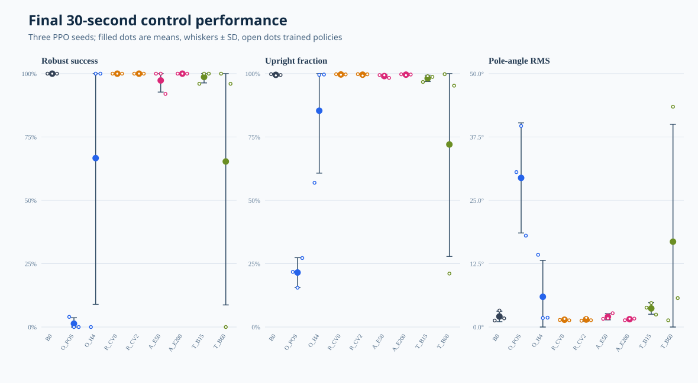
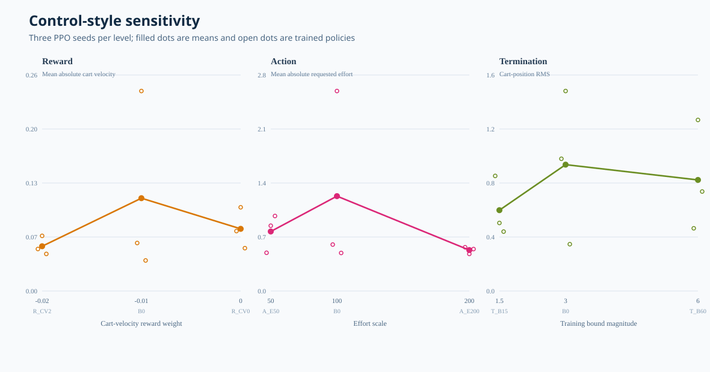
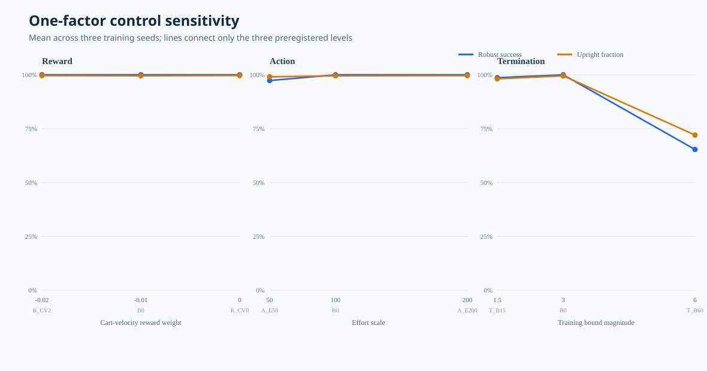
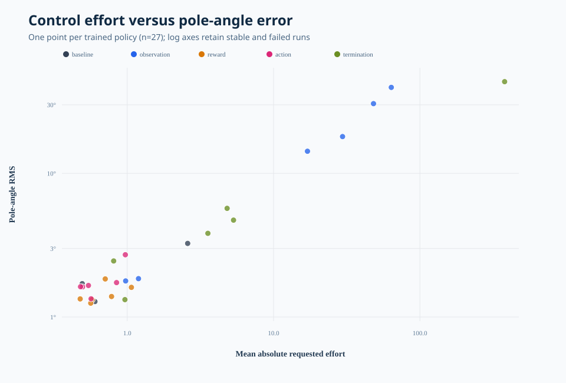

# Phase 2 CartPole Controlled RL Results

## Technical summary

The controlled study completed all 27 preregistered training cells with no
failed runs. The clearest result is that instantaneous velocity is essential
for reliable CartPole control: position-only observation reduced mean robust
30-second success from `100%` to `1.3%`. Four-frame position history recovered
strong policies for two of three training seeds, but the third failed, so
history helped without matching the reliability of direct velocity.

Reward and action-authority changes mostly preserved ceiling-level success,
but changed how the controller moved. A stronger cart-velocity penalty reduced
mean cart speed and requested effort. Higher action authority did not force
larger physical effort; PPO learned smaller normalized actions and achieved the
lowest mean requested effort of the three action levels. A wide training
boundary was brittle: two seeds remained usable, while seed 42 failed
catastrophically under the common `[-3, 3]` stress evaluation.

These are descriptive sensitivity results from three independently trained
policies per condition, not significance-tested or causal claims beyond the
controlled one-factor task contract.

## Observation choice dominated final reliability

Removing velocity made the MDP partially observable and almost eliminated
robust success. Four frames of position history recovered much of the missing
state, but its `66.7% ± 57.7%` result is the average of two fully successful
policies and one failed policy—not a uniformly medium-quality controller.



The open points in the figure are individual training seeds. Their spread is
the main evidence: `n=3` is too small for a mean alone to be trustworthy.

| Variant | Robust success | Upright fraction | Pole RMS | Requested effort |
| --- | ---: | ---: | ---: | ---: |
| `B0` | 100.0% ± 0.0% | 99.53% ± 0.25% | 2.08° ± 1.04° | 1.23 ± 1.18 |
| `O_POS` | 1.3% ± 2.3% | 21.50% ± 5.87% | 29.41° ± 10.86° | 47.21 ± 17.12 |
| `O_H4` | 66.7% ± 57.7% | 85.37% ± 24.62% | 5.96° ± 7.18° | 6.41 ± 9.22 |
| `R_CV0` | 100.0% ± 0.0% | 99.68% ± 0.10% | 1.44° ± 0.15° | 0.81 ± 0.25 |
| `R_CV2` | 100.0% ± 0.0% | 99.60% ± 0.29% | 1.48° ± 0.32° | 0.58 ± 0.12 |
| `A_E50` | 97.3% ± 4.6% | 99.05% ± 0.63% | 2.02° ± 0.60° | 0.77 ± 0.25 |
| `A_E200` | 100.0% ± 0.0% | 99.60% ± 0.18% | 1.54° ± 0.18° | 0.53 ± 0.04 |
| `T_B15` | 98.7% ± 2.3% | 98.14% ± 1.25% | 3.67° ± 1.14° | 3.23 ± 2.28 |
| `T_B60` | 65.3% ± 56.6% | 72.04% ± 44.19% | 16.83° ± 23.16° | 128.46 ± 217.50 |

Values are mean ± sample SD across training seeds `7`, `42`, and `123`.
Exact machine-readable values are in
[`condition_summary.csv`](../data/condition_summary.csv).

## The final checkpoint hides non-monotonic learning

Seed-42 screening evaluated ten numbered checkpoints per variant. Baseline,
reward, and action variants reached a plateau quickly. Position-only control
briefly reached roughly 90% upright and then degraded toward 20% as training
continued. Four-frame history showed the opposite trajectory and reached a
strong final seed-42 policy. The wide-boundary condition stayed weak throughout
this seed.


This is evidence against selecting a policy solely by final step or training
reward. The curve is a single-training-seed diagnostic; the 30-second result
above is the cross-seed comparison.

## Objective and interface changes altered control style

Reward weights `0`, `-0.01`, and `-0.02` all retained 100% mean robust success.
The stronger penalty reduced mean absolute cart velocity from `0.112` at the
baseline weight to `0.054`. Action scale `200` also reduced requested effort:
the policy compensated for greater authority by outputting smaller normalized
actions. This is why action scale and actual requested effort must be recorded
separately.



The reward and action conclusions are primarily about motion and effort, not
survival. The termination result is different: widening the training boundary
to `6` made the result strongly seed-dependent and exposed a true reliability
failure under the common evaluation boundary.



## Failed policies occupy a distinct effort-error regime

The log-scale scatter retains all 27 trained policies without letting the
catastrophic runs compress the successful cluster. Position-only failures and
the failed wide-boundary seed combine large pole error with much larger
requested effort. Stable reward/action policies occupy the low-error,
low-effort region.



The plot is descriptive. Requested effort is the absolute commanded effort,
not measured electrical energy or real actuator work.

## Scope, data, and metric definitions

- Task: manager-based `Isaac-Cartpole-v0`.
- Algorithm: Isaac Lab official skrl PPO entry point.
- Training: 4096 parallel environments, 9.83M transitions, seeds `42`, `7`,
  and `123`.
- Final evaluation: seed `101`, fixed environment IDs `0..24`, one episode
  each, 30 seconds, common `[-3, 3]` boundary.
- Statistical unit: one trained policy. The 25 episodes estimate that policy's
  behavior; they do not increase the number of independent training runs.
- Upright: wrapped pole angle within `12°`.
- Robust success: at least 95% of episode steps upright and no out-of-bounds
  termination.
- Requested effort: `abs(normalized action × configured effort scale)`.

The tracked evidence contains 27 run manifests, 675 final episode rows, 90
checkpoint evaluations, and 24 within-training-seed contrasts.

## Methodology and reproducibility

Every variant changed one allowlisted configuration path relative to `B0`.
Observation and action interface changes were applied during both training and
evaluation; reward and training-boundary changes were applied only during
training. Final policies were all evaluated under the same 30-second task
contract.

The formal evaluation protocol was amended before cross-variant results were
collected: instead of five sequential evaluation seeds with five environments
each, it uses one fixed seed with 25 deterministic parallel environment IDs.
Episode count stayed 25, and the trained policy remained the statistical unit.
The amendment reduced GPU time without mixing manager-based and Direct-task
metrics.

Rebuild all tables and figures from the local raw archive with:

```bash
uv run python tools/build_phase2_artifacts.py \
  artifacts/phase2/raw/extracted/cartpole_controlled_study \
  --output artifacts/phase2
```

## Limitations and robustness

- Three training seeds expose large failures but do not support strong
  inferential claims.
- CartPole is ceiling-prone; reward and action variants can look identical on
  survival while differing in control style.
- The evaluation uses deterministic initial states from one fixed simulator
  seed. It is reproducible but not a broad domain-randomization test.
- No external disturbances, sensor noise, latency, or dynamics randomization
  were included.
- Full per-step traces were not collected, so representative time-series trace
  figures from the preregistered plan are omitted rather than reconstructed.
- Conclusions apply to this manager-based task and checkpoint interface, not
  `Isaac-Cartpole-Direct-v0` or contact-rich manipulation.

## Recommended next step

Phase 2 has served its purpose: it established an auditable controlled-RL
workflow and demonstrated that observation design and training termination can
create seed-level reliability failures even on a simple task. More CartPole
parameter sweeps have diminishing educational value.

Advance to Phase 3 with a state-based Franka reach task, then cube lift. Carry
forward the same contracts: multiple training seeds, fixed closed-loop
evaluation, per-episode outcomes, control-style telemetry, immutable manifests,
and explicit failed runs.

## Further questions

- Does four-frame history remain brittle with five or ten training seeds?
- Can observation normalization or recurrent memory recover position-only
  reliability without direct velocity?
- Does the wide-boundary failure persist under more seeds, or is it a rare PPO
  collapse?
- Which Phase 2 metrics transfer cleanly to reach and lift, and which need
  replacement by end-effector error, success, collision, and smoothness?
