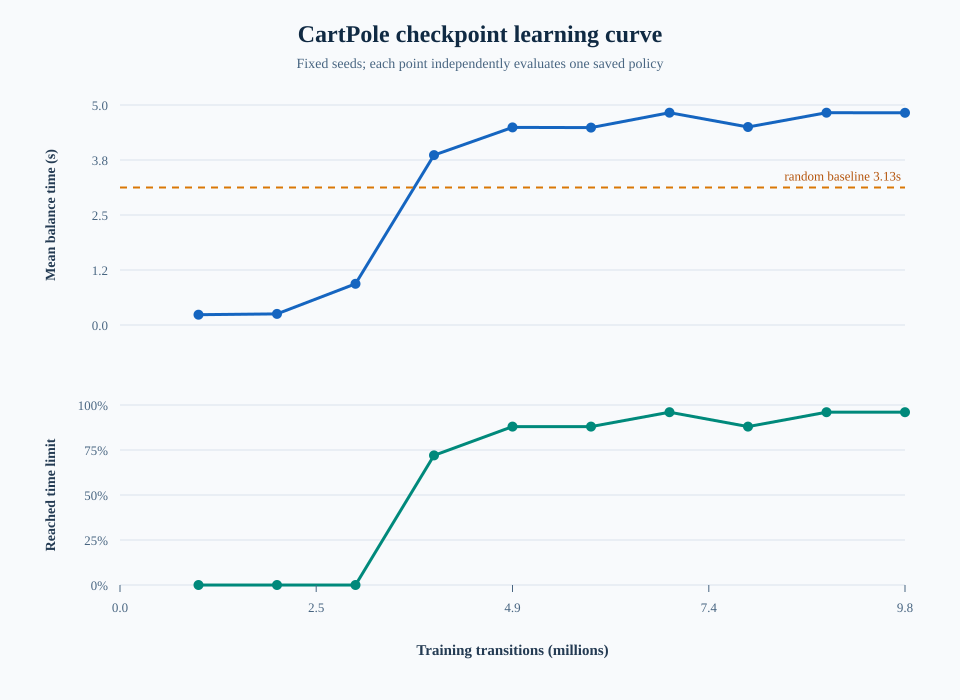

# Stage 01: CartPole PPO

This stage develops one complete reinforcement-learning workflow on the same
manager-based `Isaac-Cartpole-v0` MDP. The reproduction, checkpoint learning
curve, and reward ablation are sections of this stage rather than separate
folders.

| Section | Question | Status |
| --- | --- | --- |
| 01 — Reproduction | Can PPO learn the accepted behavior from scratch? | complete |
| 02 — Checkpoint learning curve | How does ability change during that same training run? | complete |
| 03 — Reward ablation | How does one reward term change the learned control style? | planned |

The stage is complete only after we can reproduce learning, measure how it
develops, and explain at least one controlled behavior change.

## 01 — PPO reproduction

### Question

Can a fresh PPO run reproduce the official manager-based CartPole behavior
without pretrained weights or hidden resume state?

### Key commands

Train from scratch:

```bash
./isaaclab.sh -p scripts/reinforcement_learning/train.py \
  --rl_library=skrl \
  --task=Isaac-Cartpole-v0 \
  --algorithm=PPO \
  --seed=42 \
  --num_envs=4096 \
  --viz none
```

Inspect checkpoint provenance:

```bash
find logs/skrl/cartpole -type f -name 'agent_*.pt' -print
```

Evaluate one exact checkpoint:

```bash
./isaaclab.sh -p /workspace/robotics-issac-learning/tools/evaluate_cartpole.py \
  --policy=trained \
  --task=Isaac-Cartpole-v0 \
  --checkpoint=logs/skrl/cartpole/<run>/checkpoints/best_agent.pt \
  --seeds=101,202,303,404,505 \
  --episodes-per-seed=5 \
  --num-envs=64 \
  --output=/workspace/robotics-issac-learning/artifacts/evaluations/trained_policy.json \
  --viz none
```

Play the evaluated policy:

```bash
./isaaclab.sh -p scripts/reinforcement_learning/play.py \
  --rl_library=skrl \
  --task=Isaac-Cartpole-v0 \
  --algorithm=PPO \
  --num_envs=1 \
  --checkpoint=logs/skrl/cartpole/<run>/checkpoints/best_agent.pt \
  --viz kit
```

### Result

The seed-42 local policy reached `269.44` mean steps, about `4.49` seconds at
60 Hz, with `22/25` episodes reaching the five-second time limit. The user
confirmed stable behavior in the Viewer.

## 02 — Checkpoint learning curve

### Question

As PPO receives more transitions, how long can the learned policy balance the
pole under one fixed evaluation contract?

### Metrics

The main y-axis is mean balance time:

```text
mean balance seconds = mean episode control steps / 60 Hz
```

The second panel reports the fraction of episodes reaching the five-second
time limit. The x-axis is total training transitions:

```text
training transitions = checkpoint vector steps x 4096 environments
```

For example, `agent_240.pt` represents `983,040` transitions and
`agent_2400.pt` represents `9,830,400` transitions.

### Key commands

Evaluate every numbered checkpoint in one Isaac process with identical seeds:

```bash
./isaaclab.sh -p /workspace/robotics-issac-learning/tools/evaluate_cartpole.py \
  --policy=sweep \
  --task=Isaac-Cartpole-v0 \
  --checkpoint-dir=logs/skrl/cartpole/<run>/checkpoints \
  --training-num-envs=4096 \
  --include-random-baseline \
  --seeds=101,202,303,404,505 \
  --episodes-per-seed=5 \
  --num-envs=64 \
  --output=/workspace/robotics-issac-learning/artifacts/evaluations/phase1_learning_curve.json \
  --viz none
```

Render the reviewed JSON as a dependency-free SVG:

```bash
./isaaclab.sh -p \
  /workspace/robotics-issac-learning/tools/render_learning_curve.py \
  /workspace/robotics-issac-learning/artifacts/evaluations/phase1_learning_curve.json \
  /workspace/robotics-issac-learning/artifacts/plots/phase1_learning_curve.svg
```

The repository wrapper is:

```bash
ISAAC_CHECKPOINT_DIR=logs/skrl/cartpole/<run>/checkpoints \
make learning-curve
```

### Result



| Vector steps | Training transitions | Mean balance time | Time-limit episodes |
| ---: | ---: | ---: | ---: |
| random | — | 3.125 s | 0 / 25 |
| 240 | 983,040 | 0.234 s | 0 / 25 |
| 480 | 1,966,080 | 0.253 s | 0 / 25 |
| 720 | 2,949,120 | 0.935 s | 0 / 25 |
| 960 | 3,932,160 | 3.861 s | 18 / 25 |
| 1200 | 4,915,200 | 4.491 s | 22 / 25 |
| 1440 | 5,898,240 | 4.487 s | 22 / 25 |
| 1680 | 6,881,280 | 4.824 s | 24 / 25 |
| 1920 | 7,864,320 | 4.500 s | 22 / 25 |
| 2160 | 8,847,360 | 4.825 s | 24 / 25 |
| 2400 | 9,830,400 | 4.823 s | 24 / 25 |

The random policy is a measured horizontal reference, not a fake step-zero
checkpoint. The early learned policies were worse than random. The large
behavioral transition occurred between roughly 3 and 5 million transitions,
followed by a plateau near 4.8 seconds. The dip at 7.86 million transitions
confirms that PPO checkpoint performance need not improve monotonically.

The final numbered checkpoint reached `24/25` time-limit episodes, while
`best_agent.pt` previously reached `22/25` under the same evaluator. The
trainer's best-checkpoint criterion therefore does not exactly match the
fixed-seed behavioral acceptance metric.

### Evidence

- Episode-level JSON:
  `artifacts/evaluations/phase1_learning_curve.json`
- Rendered SVG: `artifacts/plots/phase1_learning_curve.svg`
- Exact sweep command: `artifacts/commands/phase1_learning_curve.log`
- Training logs and resolved configs: `artifacts/training/phase1/`

## 03 — Cart-velocity reward ablation

### Question

Does the cart-velocity penalty explain why one successful policy makes sparse,
anticipatory corrections while another moves more continuously?

### Controlled change

Keep the task, observations, actions, terminations, PPO config, seeds, training
horizon, and evaluation protocol fixed. Change only:

```text
baseline: cart_vel.weight = -0.01
ablation: cart_vel.weight = 0.0
```

### Measurements

- mean balance seconds;
- five-second time-limit fraction;
- mean absolute pole angle;
- mean absolute cart velocity;
- mean absolute action and action change;
- action sign changes per second.

### Hypothesis

Removing the cart-velocity penalty increases movement and corrective activity
without necessarily improving survival. The hypothesis is accepted only if the
control telemetry changes consistently across training seeds.

### Current status

The experiment design is locked, but the reward override and control telemetry
are not yet implemented. Do not start a paid run until both are locally tested.
